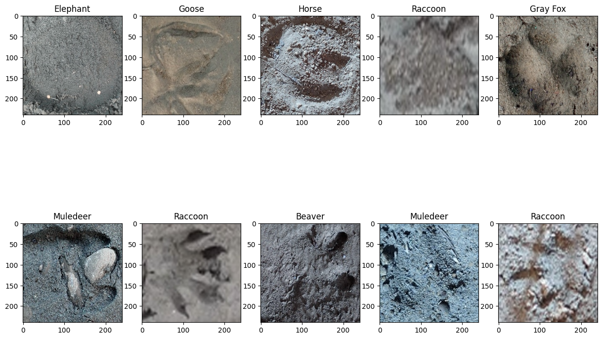
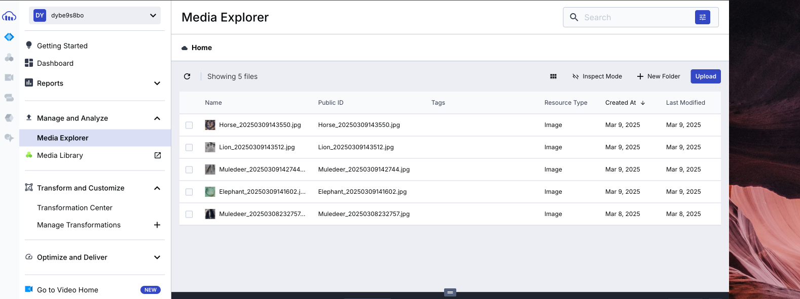
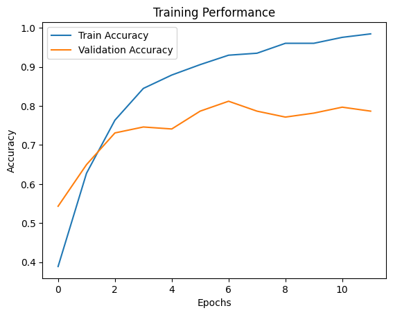
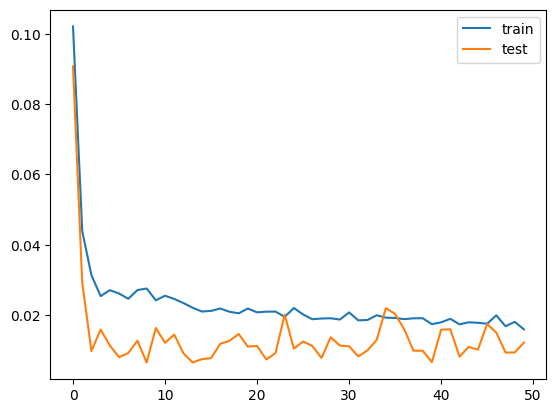
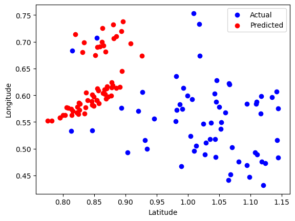

# AnimalTrackID: An ML-based Solution for Noninvasive Wildlife Tracking from Animal Tracks


[Demo Video: Watch Here](https://drive.google.com/file/d/1JVQTWhgEINSDOY9yx1aFQIDTo3FCztpD/view?usp=sharing)

## Abstract
Wildlife tracking is the science that facilitates identifying and interpreting the signs of animal activity and provides accurate and localized observations amid a changing world. The benefits of wildlife tracking underscore its importance in wildlife conservation—it unpacks information relating not only to species identification and recognition but also to population dynamics, migration patterns, habitat use, and the effects of environmental changes. Most traditional wildlife tracking methods, such as collaring, banding, and GPS tracking, are invasive methods that require physical interaction with wildlife, potentially causing stress or disrupting its natural behavior. In addition, these methods are expensive and logistically challenging. However, the impressions left by the foot of terrestrial animals provide a noninvasive alternative to traditional wildlife tracking methods. Despite its potential, building machine learning models for wildlife tracking remains a daunting challenge due to the absence of a comprehensive and well-labeled dataset. This leaves researchers and conservationists without a scalable, cost-effective tool for tracking wildlife. This project seeks to amplify the need to curate a comprehensive dataset of animal footprints by leveraging the first publicly available open-source dataset to develop a machine-learning model to classify animal footprints, aiding in species identification and providing insights into their movement patterns and habitat usage. The implementation of this work will contribute to advancing non-invasive wildlife tracking methods, addressing the limitations of traditional approaches by offering a scalable and cost-effective solution. It will provide the conservation sector and researchers with a tool to classify animal footprints accurately, enabling improved species identification, wildlife monitoring and studies, and understanding of habitat usage.

## Project Update

AnimalTrackID builds upon Shinoda et al. (2024) dataset to showcase the ability of machine learning models to deliver valuable insights on species while amplifying the need for a comprehensive dataset for future advancement. The project will thrive in sourcing and adding more data to the base dataset, augmenting the existing dataset, and creating an open-source dataset for public. Some notable changes have already been made to the dataset which are highlighted below: 



- `ml-model/classifier/dataprep.py`: Loads the data folder and resizes the images to 240 * 240
- `ml-model/classifier/datagen.py`: An augmentation class augments data in different folders according to a defined rule created to handle class imbalances.

The notebook contains a `data preprocessing class` and a test CNN architecture for classification which raised concerns of overfitting and class imbalance. A second iteration was explored to access the performance of `Vision Transformers` (ml-model/classifier/vit.py`) and not much success was recorded as limited hardware resources and the complexity of the task exhausted avaialable application memory.

Challenge:
- Due to the hardware requirements and compute resources needed to train a model with 18 classes, the dataset classes were dropped to six (6) instead of 18, after several iterations and observations.

## The Solution: AnimalTrackID 

AnimalTrackID is an AI-powered solution designed to provide a noninvasive and cost-effective method for tracking wildlife based on their footprints. The system consists of two main components:

1. Mobile App

Designed for on-field trackers and local communities living close to wildlife, the mobile app allows users to:

- Capture or upload footprint images to log classification results.

- Submit new footprint samples to enhance dataset curation, aiding in the development of more accurate models.



2. Web Dashboard

Built for conservationists and data analysts, the web dashboard provides the following functionalities:

- Classification Reports: View detailed reports on tracked footprints.

- Data Submission Reports: Monitor new footprint samples submitted by users.

- CSV Export: Download classification reports for in-depth data analysis.

- LSTM Prediction Model: Predict future footprint locations for specific species based on historical data.

AnimalTrackID aims to bridge the gap between technology and conservation, empowering communities and researchers with better tools for wildlife tracking and protection.

## The Classifier Model

The project capitalizes on transfer learning to build an algorithm whose base is the **Xception model**. This model outperformed vision transformers in terms of accuracy and loss when classifying six animal species based on their footprints.

### Performance Metrics

Test Accuracy: 82.93%

Train Accuracy: 94.55%

Validation Accuracy: 76.14%

Test Loss: 0.6

Train Loss: 0.1

Validation Loss: 0.8



## The LSTM Predictor: Case Study of the Lion

The LSTM (Long Short-Term Memory) model is designed to predict future footprint locations based on historical sightings. By analyzing past footprint data, the model learns temporal patterns and movement tendencies of specific species. After training for 50 epochs, the model achieved a low loss of 0.0158 and a mean absolute error (MAE) of 0.0971, with validation loss and MAE of 0.0121 and 0.1002, respectively. These results indicate that the model can accurately infer the next likely location where footprints will appear, helping conservationists anticipate wildlife movement and optimize tracking efforts.



Additionally, the LSTM model was able to provide predicted points that fall within the same bounding box as y_true, further validating its effectiveness in forecasting wildlife movement.



## Tech Stack

AnimalTrackID is built using a modern and efficient tech stack, ensuring scalability and performance:

- Flutter - Used for developing the mobile application, providing a seamless cross-platform experience for on-field trackers and local communities.

- Python - The core language for machine learning model development, leveraging TensorFlow and other libraries for footprint classification and prediction.

- Next.js - Powers the web dashboard, offering a fast and interactive interface for conservationists and data analysts to access classification reports and insights.

- FastAPI - Used for backend development, enabling high-performance API endpoints for data submission, model inference, and retrieval of classification reports.

- PostgreSQL - Used as the primary database to store classification and data submission logs

This combination of technologies ensures a robust, user-friendly, and efficient wildlife tracking solution that empowers conservation efforts.


## Setup: Clone Repository

1. **Clone the repository**:
    ```bash
    git clone https://github.com/kayc0des/AnimalTrackID
    cd animaltrackid
    ```

2. **Create a virtual environment**:
    ```bash
    python -m venv venv
    source venv/bin/activate   # On Windows use `venv\Scripts\activate`
    ```

3. **Install the required packages**:
    ```bash
    pip install -r requirements.txt
    ```

3. **Set up environment variables**


## Start the Server in new terminal

1. **CD into the backend folder**:
    ```bash
    cd backend/fastapi/app
    uvicorn app:app --reload --host 0.0.0.0 --port 8000
    ```

## Setup: Flutter Mobile App

1. **CD into the mobile folder**:
    ```bash
    cd animaltrackid_mobile
    ```

2. **Run the app**:
    ```bash
    flutter run
    ```

3. **Interact with the app**

## Setup: Next.js Web Dashboard

1. **CD into the web folder**:
    ```bash
    cd animaltrackid_web
    ```

2. **Install dependencies**:
    ```bash
    npm install
    ```


3. **Run the app**:
    ```bash
    npm run dev
    ```

4. **Interact with the dashboard**

## Deployment Plan

Following review and feedback during testing rounds, the final version of the web dashboard will be deployed on Vercel. The APK for the mobile app will be shared for distribution. Additionally, backend deployment on Render will be explored if credits permit, ensuring a scalable and cost-effective hosting solution.

---

## Contributors

- Student: [kayc0des](https://github.com/kayc0des)
- Supervisor: Marvin Ogore